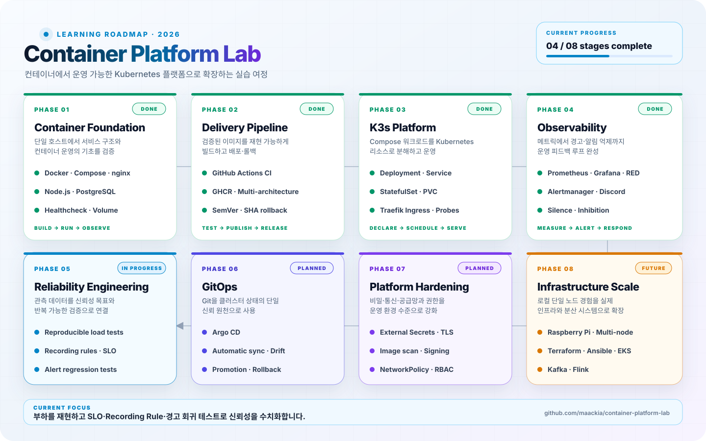

# Container Platform Lab

Docker Compose로 구성한 nginx, Node.js, PostgreSQL, Prometheus, Grafana 스택을 CI/CD와 버전 기반 배포까지 확장하고, 데모 애플리케이션과 별도 Next.js 블로그를 K3s에 배포해 Kubernetes 리소스와 클러스터 모니터링을 학습하는 실습 저장소입니다.

<a href="./docs/11-roadmap.md">
  <picture>
    <source media="(prefers-color-scheme: dark)" srcset="./docs/assets/roadmap-dark.svg">
    <source media="(prefers-color-scheme: light)" srcset="./docs/assets/roadmap-light.svg">
    
  </picture>
</a>

<p align="center"><a href="./docs/11-roadmap.md"><strong>단계별 로드맵과 다음 학습 목표 보기 →</strong></a></p>

## 아키텍처

```text
Docker Compose
Client
→ nginx
→ Node.js app
→ PostgreSQL

Node.js /metrics
→ Prometheus
→ Grafana

K3s application
Client
→ Traefik Ingress
├→ app.platform.local → Node.js Deployment → PostgreSQL StatefulSet / PVC
└→ blog.platform.local → Next.js Blog Deployment

K3s monitoring
Node.js Pod /metrics
→ ServiceMonitor
→ Prometheus Operator
→ Prometheus
├→ Grafana Dashboard
└→ PrometheusRule → Alertmanager → AlertmanagerConfig → Discord

Mac browser
→ UTM host 8081 / guest 80
→ Traefik Ingress
→ app / blog / Grafana / Prometheus / Alertmanager Service

GitHub Actions
→ Compose integration test
→ Kubernetes and Helm validation
→ GHCR multi-architecture image
```

## 기술 스택

- Docker / Docker Compose
- K3s / Kubernetes
- Helm / kube-prometheus-stack
- Prometheus Operator / ServiceMonitor
- Traefik Ingress
- nginx
- Node.js 24
- PostgreSQL
- Prometheus / Grafana
- Grafana k6
- GitHub Actions
- GitHub Container Registry
- Kubeconform

## 처음부터 따라가는 순서

이 저장소에는 Docker Compose와 K3s라는 두 실행 환경이 함께 있다. 처음 학습한다면 다음 순서를 권장한다.

```text
1. Docker Compose로 전체 스택 실행
2. Prometheus와 Grafana 동작 확인
3. GitHub Actions와 GHCR 이미지 게시 확인
4. GHCR 이미지를 K3s에 배포
5. Kubernetes 모니터링·경고·Ingress 구성
6. 별도 블로그 이미지를 K3s에 배포하고 모니터링
7. 배포 스크립트로 블로그 `latest` 이미지 갱신
8. k6로 정상·지연·오류 트래픽을 재현하고 경고 흐름 검증
```

Docker Compose 실습과 K3s 실습은 서로 다른 실행 경로다. K3s 배포만 확인하려면 Compose 실행을 생략할 수 있다.

| 실행 경로 | 애플리케이션 이미지 | 설정 방식 | 주요 명령 |
|---|---|---|---|
| 로컬 Compose | `app/Dockerfile`에서 직접 빌드 | `.env` | `make up` |
| GHCR Compose | GHCR에 게시된 이미지 pull | `.env`, `APP_IMAGE_TAG` | `docker compose -f ...` |
| K3s | GHCR에 게시된 이미지 pull | ConfigMap, Secret | `kubectl apply`, `make deploy-blog` |

## 실행 경로 1: 로컬 Docker Compose

Compose는 nginx, Node.js, PostgreSQL, Prometheus, Grafana 전체 스택을 단일 호스트에서 실행하는 첫 번째 실습입니다.

`make up`은 `app/Dockerfile`로 Node.js 애플리케이션 이미지만 빌드합니다. nginx와 PostgreSQL 같은 나머지 서비스는 각 공식 이미지를 pull해 함께 실행합니다. nginx가 애플리케이션 이미지를 만드는 것은 아닙니다.

Compose가 포트와 데이터베이스 계정 등의 변수를 읽을 수 있도록 `.env.example`을 복사합니다.

```bash
cp .env.example .env
make up
make ps
```

접속 주소:

```text
Application: http://localhost:8080
Prometheus:  http://localhost:9090
Grafana:     http://localhost:3001
```

중지:

```bash
make down
```

`Makefile`은 이 로컬 빌드 경로에서 사용하고, `.env`는 두 Compose 경로에서 공통으로 사용합니다. 주요 명령과 데이터베이스 운영 방법은 [운영 명령과 점검 방법](./docs/02-operations.md)에 정리합니다.

## 실행 경로 2: GHCR 이미지 기반 Compose

이 경로는 Compose 구조를 그대로 사용하면서 로컬 빌드 대신 GHCR에 게시된 애플리케이션 이미지를 검증합니다. nginx, PostgreSQL, Prometheus, Grafana 설정에는 계속 `.env`가 필요합니다. 기본 이미지 태그는 `latest`입니다.

```bash
cp .env.example .env
docker compose -f compose.yaml -f compose.prod.yaml pull app
docker compose -f compose.yaml -f compose.prod.yaml up -d
```

특정 버전으로 고정하려면 APP_IMAGE_TAG를 지정합니다.

```bash
APP_IMAGE_TAG=0.2.0 docker compose \
  -f compose.yaml \
  -f compose.prod.yaml \
  up -d
```

게시 이미지:

```text
ghcr.io/maackia/container-platform-lab-app
```

지원 플랫폼:

```text
linux/amd64
linux/arm64
```

## 실행 경로 3: K3s 배포

K3s는 Compose와 독립된 실행 환경입니다. `.env`를 사용하지 않으며 일반 설정은 ConfigMap, 비밀번호는 Kubernetes Secret으로 주입합니다. 애플리케이션 Deployment는 GHCR의 멀티 아키텍처 이미지를 pull합니다. `Makefile`의 `deploy-blog` 타깃은 반복되는 블로그 rollout 명령을 실행하는 편의 기능으로만 사용합니다.

K3s와 `platform-secret`을 준비한 뒤 기본 애플리케이션 매니페스트를 적용합니다. `k8s/monitoring/`과 블로그의 모니터링 리소스는 `kube-prometheus-stack` 설치 후 적용합니다.

```bash
kubectl apply -f k8s/
kubectl get all -n platform-lab
kubectl get ingress,pvc -n platform-lab
```

블로그의 기본 리소스는 모니터링 의존 리소스와 분리해 순서대로 적용합니다.

```bash
kubectl apply -f k8s/blog/00-namespace.yaml
kubectl apply -f k8s/blog/01-blog-deployment.yaml
kubectl apply -f k8s/blog/02-blog-service.yaml
kubectl apply -f k8s/blog/03-blog-ingress.yaml
kubectl get pods,service,ingress -n blog
```

블로그 저장소에서 새 `latest` 이미지가 게시된 뒤에는 다음 명령으로 블로그 Deployment만 갱신합니다.

```bash
make deploy-blog
```

이 명령은 현재 Kubernetes context와 Deployment를 확인하고, rollout을 재시작한 뒤 새 Pod가 준비될 때까지 기다립니다. 실패하면 Pod와 Deployment 진단 정보를 출력합니다.

배포 경로는 다음과 같습니다.

```text
app.platform.local
→ Traefik
→ app Service
→ Node.js Pod
→ PostgreSQL StatefulSet

blog.platform.local
→ Traefik
→ blog Service
→ Next.js Blog Pod
```

Secret 생성, UTM 포트 포워딩, 상태 확인 방법은 [K3s 기반 Kubernetes 배포](./docs/08-k3s.md)에, 블로그 배포·갱신 흐름은 [Next.js 블로그 K3s 배포와 모니터링](./docs/10-blog-k3s.md)에 정리합니다.

`k8s/01-nginx-deployment.yaml`과 `02-nginx-service.yaml`은 Deployment·Service를 익히기 위한 별도 기초 실습입니다. 실제 애플리케이션 요청은 Traefik에서 `app` Service로 직접 전달됩니다.

## K3s 모니터링과 알림

Helm으로 `kube-prometheus-stack`을 설치한 뒤 Discord Webhook Secret을 생성하고, 애플리케이션 ServiceMonitor, Grafana 대시보드, replica·HTTP 5xx 오류율·p95 응답 지연 경고 규칙, Discord 알림 라우팅과 모니터링 Ingress를 적용합니다. 유지보수 중 수동 Silence와 critical 경고 발생 시 관련 warning을 억제하는 Inhibition 정책도 함께 구성합니다. 실제 Webhook URL은 Git에 저장하지 않습니다.

```bash
helm upgrade --install monitoring \
  oci://ghcr.io/prometheus-community/charts/kube-prometheus-stack \
  --version 87.19.0 \
  --namespace monitoring \
  --create-namespace \
  -f helm/kube-prometheus-stack-values.yaml \
  --wait \
  --timeout 15m

read -rsp "Discord webhook URL: " DISCORD_WEBHOOK_URL
echo
printf '%s' "$DISCORD_WEBHOOK_URL" \
  | kubectl create secret generic alertmanager-discord-webhook \
      --namespace monitoring \
      --from-file=webhook-url=/dev/stdin \
      --dry-run=client \
      -o yaml \
  | kubectl apply -f -
unset DISCORD_WEBHOOK_URL

kubectl apply -f k8s/monitoring/
kubectl apply -f k8s/blog/04-blog-servicemonitor.yaml
kubectl apply -f k8s/blog/05-blog-dashboard-configmap.yaml
kubectl get servicemonitor app -n platform-lab
kubectl get servicemonitor blog -n blog
kubectl get prometheusrule platform-app-alerts -n platform-lab
kubectl get pods -n monitoring
```

Mac의 `/etc/hosts`에 다음 항목을 추가하고, UTM에서 호스트 `8081`을 Ubuntu 게스트 `80`으로 전달합니다.

```text
127.0.0.1 app.platform.local
127.0.0.1 blog.platform.local
127.0.0.1 grafana.platform.local
127.0.0.1 prometheus.platform.local
127.0.0.1 alertmanager.platform.local
```

접속 주소:

```text
Application:  http://app.platform.local:8081
Blog:         http://blog.platform.local:8081
Grafana:      http://grafana.platform.local:8081
Prometheus:   http://prometheus.platform.local:8081
Alertmanager: http://alertmanager.platform.local:8081
```

상세 설정과 검증 방법은 [Kubernetes 모니터링과 알림](./docs/09-kubernetes-monitoring.md)에 정리합니다.

## k6 부하 테스트

k6 시나리오는 K3s의 Traefik Ingress를 통해 애플리케이션에 요청을 보내고, Prometheus·Grafana·Alertmanager·Discord까지 이어지는 관측성과 경고 흐름을 반복해서 검증합니다.

```bash
make load-test-validate
make load-test-smoke
make load-test-baseline
make load-test-latency
make load-test-error-rate
```

기본 연결 주소는 Ubuntu VM의 `http://127.0.0.1`이며 HTTP `Host` 헤더로 `app.platform.local`을 전달합니다. 다른 주소를 사용하려면 `K6_BASE_URL`과 `K6_TARGET_HOST`를 덮어쓸 수 있습니다.

```bash
make load-test-smoke \
  K6_BASE_URL=http://127.0.0.1 \
  K6_TARGET_HOST=app.platform.local
```

`latency`와 `error-rate`는 실습용 `/slow`, `/error` 엔드포인트를 사용하므로 `LAB_TEST_ENDPOINTS_ENABLED=true`인 학습 환경에서만 실행합니다. 설치 방법, 각 시나리오의 합격 기준과 결과 해석은 [k6 부하 테스트와 경고 검증](./docs/12-load-testing.md)에 정리합니다.

## 주요 기능

- nginx reverse proxy와 Node.js / PostgreSQL 3-tier 구성
- healthcheck와 service_healthy 기반 시작 순서 제어
- PostgreSQL init SQL, named volume, data-only 백업/복구
- Prometheus 메트릭 수집과 Grafana 자동 provisioning
- Counter·Histogram 기반 요청률·오류율·p95 응답시간 RED 메트릭
- GitHub Actions 기반 문법·Compose·이미지 빌드 검증
- 전체 Compose 스택 통합 테스트와 readiness 재시도
- GHCR latest, 커밋 SHA, SemVer 이미지 게시
- amd64 / arm64 멀티 아키텍처 이미지
- compose.prod.yaml 기반 버전 고정 배포와 롤백
- K3s Namespace, Deployment, Service, ConfigMap, Secret 구성
- PostgreSQL StatefulSet와 local-path PVC
- Traefik Ingress와 readiness/liveness probe
- GHCR `latest` 기반 Next.js 블로그 Deployment·Service·Ingress
- 블로그 startup/readiness/liveness probe와 `make deploy-blog` 기반 rollout 자동화
- Helm 기반 kube-prometheus-stack 구성
- ServiceMonitor 기반 애플리케이션 target 자동 발견
- Grafana ConfigMap 기반 대시보드 provisioning
- 블로그 target·게시글·Pod 리소스 Grafana 대시보드
- Grafana 기반 애플리케이션 RED·Pod 리소스 대시보드
- PrometheusRule 기반 replica 저하·전체 중단·HTTP 5xx 오류율·p95 응답 지연 경고
- AlertmanagerConfig와 Kubernetes Secret 기반 Discord FIRING·RESOLVED 알림
- Alertmanager Silence와 namespace·service 라벨 기반 critical → warning Inhibition
- k6 smoke·baseline·latency·error-rate 시나리오와 Makefile 실행 명령
- 부하 기반 p95·HTTP 5xx 경고와 Discord FIRING·RESOLVED 회귀 검증
- Traefik 호스트 라우팅 기반 모니터링 서비스 접근
- Kubeconform 기반 Kubernetes·Helm 렌더링 결과 CI 검증

## 프로젝트 구조

```text
.
├── .github/workflows
│   ├── ci.yml
│   └── publish.yml
├── app
├── db/init
├── docs
│   ├── README.md
│   ├── 01-architecture.md
│   ├── 02-operations.md
│   ├── 03-database-init-and-timezone.md
│   ├── 04-backup-and-restore.md
│   ├── 05-monitoring.md
│   ├── 06-ci-cd.md
│   ├── 07-production-compose.md
│   ├── 08-k3s.md
│   ├── 09-kubernetes-monitoring.md
│   ├── 10-blog-k3s.md
│   ├── 11-roadmap.md
│   ├── 12-load-testing.md
│   └── assets
│       ├── roadmap-dark.svg
│       └── roadmap-light.svg
├── grafana/dashboards
│   ├── blog-overview.json
│   └── platform-app-overview.json
├── helm
│   └── kube-prometheus-stack-values.yaml
├── k8s
│   ├── 00-namespace.yaml
│   ├── ...
│   ├── 09-app-ingress.yaml
│   ├── blog
│   │   ├── 00-namespace.yaml
│   │   ├── 01-blog-deployment.yaml
│   │   ├── ...
│   │   └── 05-blog-dashboard-configmap.yaml
│   └── monitoring
│       ├── 10-app-servicemonitor.yaml
│       ├── 11-platform-app-dashboard-configmap.yaml
│       ├── 12-platform-app-prometheusrule.yaml
│       ├── 13-monitoring-ingress.yaml
│       ├── 14-platform-discord-alertmanagerconfig.yaml
│       └── 15-platform-alert-inhibition.yaml
├── load-tests
│   ├── smoke.js
│   ├── baseline.js
│   ├── latency.js
│   └── error-rate.js
├── monitoring
├── nginx
├── scripts
│   └── deploy-blog.sh
├── compose.yaml
├── compose.prod.yaml
├── Makefile
└── README.md
```

## 문서

자세한 설명과 실습 기록은 [문서 목차](./docs/README.md)에 정리합니다.

- [프로젝트 구조와 아키텍처](./docs/01-architecture.md)
- [운영 명령과 점검 방법](./docs/02-operations.md)
- [데이터베이스 초기화와 시간대 정책](./docs/03-database-init-and-timezone.md)
- [PostgreSQL 백업과 복구](./docs/04-backup-and-restore.md)
- [Prometheus와 Grafana 모니터링](./docs/05-monitoring.md)
- [GitHub Actions CI와 GHCR 이미지 게시](./docs/06-ci-cd.md)
- [배포용 Compose와 버전 롤백](./docs/07-production-compose.md)
- [K3s 기반 Kubernetes 배포](./docs/08-k3s.md)
- [Kubernetes 모니터링과 알림](./docs/09-kubernetes-monitoring.md)
- [Next.js 블로그 K3s 배포와 모니터링](./docs/10-blog-k3s.md)
- [학습 로드맵과 다음 단계](./docs/11-roadmap.md)
- [k6 부하 테스트와 경고 검증](./docs/12-load-testing.md)

## 현재 완료 범위

```text
Docker Compose 스택
→ 모니터링
→ CI 및 통합 테스트
→ GHCR 멀티 아키텍처 게시
→ SemVer v0.2.0
→ 버전 고정 배포와 SHA 롤백
→ K3s 애플리케이션·데이터베이스 배포
→ Traefik 호스트 기반 Ingress와 PVC
→ kube-prometheus-stack
→ ServiceMonitor 기반 앱 메트릭 수집
→ Grafana RED 대시보드 자동 provisioning
→ PrometheusRule 기반 replica·HTTP 5xx 오류율·p95 응답 지연 경고
→ Alertmanager·Discord FIRING/RESOLVED 알림 검증
→ Alertmanager Silence와 critical → warning Inhibition 검증
→ Kubernetes·Helm 매니페스트 CI 검증
→ Next.js 블로그 K3s 배포
→ 블로그 ServiceMonitor와 Grafana 대시보드 provisioning
→ 블로그 `latest` 이미지 rollout 자동화와 CI 스크립트 검증
→ k6 정상·지연·오류 트래픽 시나리오
→ 부하 기반 p95·HTTP 5xx 경고와 Discord 알림 검증
```

.env, backups/, 실제 Secret 값은 Git에 포함하지 않습니다.
