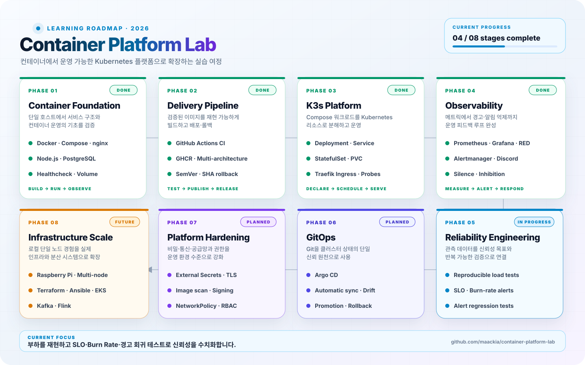

# Container Platform Lab

Docker Compose에서 시작해 K3s 배포, CI/CD, 관측성, 경고, 부하 테스트와 SLI/SLO까지 확장한 컨테이너 플랫폼 실습 저장소입니다. 현재 주 실행 환경은 K3s이며, Compose 구성은 컨테이너 기초 학습과 CI 통합 테스트용으로 함께 유지합니다.

<a href="./docs/11-roadmap.md">
  <picture>
    <source media="(prefers-color-scheme: dark)" srcset="./docs/assets/roadmap-dark.svg">
    <source media="(prefers-color-scheme: light)" srcset="./docs/assets/roadmap-light.svg">
    
  </picture>
</a>

<p align="center"><a href="./docs/11-roadmap.md"><strong>완료 범위와 다음 학습 목표 보기 →</strong></a></p>

## 현재 구성

```text
Mac browser :8081
→ UTM Ubuntu :80
→ K3s Traefik Ingress
├→ app.platform.local  → Node.js Deployment → PostgreSQL StatefulSet / PVC
└→ blog.platform.local → Next.js Blog Deployment

Application /metrics
→ ServiceMonitor → Prometheus Operator → Prometheus
├→ Recording Rule → SLI / SLO / Error Budget / Burn Rate → Grafana
└→ Multi-window PrometheusRule → Alertmanager → Discord

GitHub Actions
→ Compose integration test
→ Kubernetes·Helm·k6 validation
→ GHCR amd64 / arm64 image publishing
```

## 실행 경로

| 경로 | 용도 | 시작점 |
|---|---|---|
| K3s | 현재 주 실습 환경 | [K3s 배포 문서](./docs/08-k3s.md) |
| Docker Compose | 컨테이너 기초와 로컬 통합 실행 | [운영 문서](./docs/02-operations.md) |
| GHCR Compose | 게시 이미지의 버전 고정 배포와 롤백 | [배포용 Compose 문서](./docs/07-production-compose.md) |

K3s와 Compose는 서로 독립된 실행 경로입니다. K3s만 실습할 때 Compose를 먼저 실행할 필요는 없습니다.

## 빠른 시작

### Docker Compose

```bash
cp .env.example .env
make up
make ps
```

### K3s 애플리케이션

K3s와 애플리케이션 Secret을 준비한 뒤 기본 리소스를 적용합니다. 모니터링 리소스는 `kube-prometheus-stack`과 Discord Webhook Secret을 준비한 후 별도로 적용합니다.

```bash
kubectl apply -f k8s/
kubectl get all -n platform-lab
```

```bash
kubectl apply -f k8s/monitoring/
kubectl get pods -n monitoring
```

환경 준비, Secret 생성, Helm 설치와 검증 순서는 다음 문서를 따릅니다.

- [K3s 기반 Kubernetes 배포](./docs/08-k3s.md)
- [Kubernetes 모니터링과 알림](./docs/09-kubernetes-monitoring.md)
- [Next.js 블로그 K3s 배포와 모니터링](./docs/10-blog-k3s.md)

## 주요 구현 범위

- nginx, Node.js, PostgreSQL 기반 3-tier 애플리케이션
- Docker Compose와 GHCR 버전 고정 배포·롤백
- K3s Deployment, StatefulSet, PVC, ConfigMap, Secret, Traefik Ingress
- GitHub Actions CI와 GHCR 멀티 아키텍처 이미지 게시
- Prometheus Operator, ServiceMonitor, Grafana provisioning
- RED 메트릭, 경고 규칙, Discord FIRING·RESOLVED 알림
- Alertmanager Silence와 critical → warning Inhibition
- k6 smoke·baseline·latency·error-rate 시나리오
- Recording Rule, SLI/SLO, rolling 1h Error Budget와 multi-window Burn Rate 경고

## 문서

전체 문서는 [문서 목차](./docs/README.md)에서 주제별로 확인할 수 있습니다.

- [프로젝트 구조와 아키텍처](./docs/01-architecture.md)
- [GitHub Actions CI와 GHCR 이미지 게시](./docs/06-ci-cd.md)
- [Kubernetes 모니터링과 알림](./docs/09-kubernetes-monitoring.md)
- [k6 부하 테스트와 경고 검증](./docs/12-load-testing.md)
- [Recording Rule과 SLI/SLO·Error Budget](./docs/13-sli-slo-error-budget.md)
- [Multi-window Burn Rate 경고](./docs/14-multi-window-burn-rate.md)
- [VM 시간 동기화와 모니터링 복구](./docs/15-vm-time-sync-and-monitoring-recovery.md)

## 보안 원칙

`.env`, `backups/`, Discord Webhook URL과 실제 Kubernetes Secret 값은 Git에 포함하지 않습니다. 재현에 필요한 ConfigMap, ServiceMonitor, PrometheusRule과 Grafana 대시보드 정의만 저장소에서 관리합니다.
